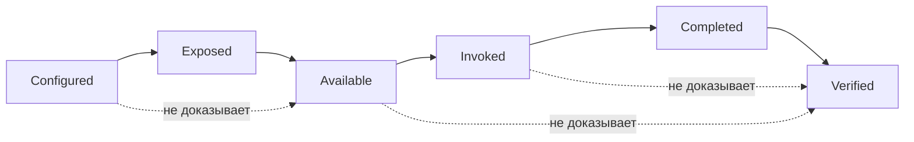

# Configured ≠ available: галочка ещё не capability

```text
Origin: editorial synthesis / public field evidence
Mode: Jester
Status: essay
Date: 2026-09-06
```

Иногда самый дорогой баг выглядит как зелёная галочка.

Интерфейс говорит: **enabled**.
CLI говорит: **enabled**.
Настройка сохранена.
Сервер, возможно, даже отвечает.
А агент всё равно не может вызвать инструмент.

И вот здесь начинается очень полезная инженерная неприятность: слово «доступен» оказывается слишком большим и слишком ленивым.

## Фейнман: что именно сломалось

Представим ресторан.

На двери висит табличка **OPEN**. Свет горит. Повар на месте. Кухня принимает заказы.

Но официант в вашем зале почему-то не получил меню.

Можно ли сказать, что ресторан «работает»?

В бытовом разговоре — почти да.
В инженерном — этого ответа недостаточно.

Для агента capability проходит несколько разных состояний:

```text
CONFIGURED
  настройка существует

EXPOSED
  runtime вообще показывает эту возможность

AVAILABLE
  конкретный маршрут сейчас работоспособен

INVOKED
  инструмент действительно вызван

COMPLETED
  вызов дошёл до заявленного результата

VERIFIED
  результат подтверждён наблюдаемым postcondition / readback
```

Проблемы начинаются, когда продукт сворачивает всю эту цепочку в одну зелёную лампочку.

## Полевой случай: Codex и MCP

В публичном issue OpenAI Codex описан очень чистый пример.

Codex App Settings показывает несколько MCP-серверов как enabled. `codex mcp list` показывает те же серверы как enabled. Но активная сессия получает callable tools только от части из них.

В исходном отчёте наблюдаемая форма была такой:

```text
Enabled MCP servers in Settings: 4
Enabled MCP servers in codex mcp list: 4
MCP servers with tools exposed to active session: 1
```

То есть конфигурация существует, но сессионная tool-surface ей не соответствует.

Источник: [openai/codex#21654](https://github.com/openai/codex/issues/21654)

Мы позже добавили в тот же публичный тред ещё один datapoint с Windows/WSL: восемь MCP-серверов были сконфигурированы, runtime видел пять как доступные и три как unavailable; внешний JSON-RPC probe для одного из пропавших серверов успешно проходил `initialize → notifications/initialized → tools/list` и возвращал все ожидаемые tools. Это сузило проблему: сервер жив, protocol discovery жив, а разрыв находится позже — вокруг caching/attachment к текущей сессии.

Это уже не «MCP не работает».

Это гораздо полезнее:

```text
server health          = observed healthy
protocol discovery     = observed healthy
session attachment     = failed / unavailable
callable tool surface  = incomplete
```

И именно поэтому хорошие диагностические состояния важнее одной общей галочки.

## Пять почему

**1. Почему зелёная галочка вводит в заблуждение?**  
Потому что она обычно подтверждает только один слой — например, сохранённую конфигурацию.

**2. Почему этого мало?**  
Потому что agent runtime состоит из нескольких переходов: startup, auth, discovery, schema import, session attachment, invocation, verification.

**3. Почему пользователь начинает перезапускать всё подряд?**  
Потому что UI не показывает, на каком переходе произошёл разрыв. Когда нет состояния, остаётся ритуал.

**4. Почему логов после факта тоже часто недостаточно?**  
Потому что они могут потерять различие между `configured`, `selected`, `invoked`, `completed` и `verified`.

**5. Почему это уже архитектурная проблема, а не просто UX?**  
Потому что без наблюдаемого lifecycle агент и оператор начинают придумывать состояние системы вместо того, чтобы его читать.

## Та же грабля в другой одежде: MarcoPolo

В нашем публичном feature request к MarcoPolo про runtime telemetry вопрос возник ровно из этого же класса проблем.

Мы предложили не новый «красивый dashboard», а маленький lifecycle trace:

```text
configured
!=
selected
!=
invoked
!=
completed
!=
verified
```

Источник: [immersa-co/marcopolo-plugin#19](https://github.com/immersa-co/marcopolo-plugin/issues/19)

Там же появился очень практичный тезис: если runtime уже сидит в точке, где происходят route selection, tool calls и readback, то именно там дешевле всего сохранить различия, которые потом невозможно честно восстановить из обрывков audit log.

Соседний feature request про discoverability добавил вторую половину проблемы: capability может существовать, но её lifecycle, scope, precedence и observable proof могут быть спрятаны по UI, документации, source code и историческим следам.

Источник: [immersa-co/marcopolo-plugin#20](https://github.com/immersa-co/marcopolo-plugin/issues/20)

Там родилась фраза, которая мне нравится:

> Простая кнопка хороша. Простая кнопка без карты превращается в археологию.

## Mermaid: почему одна галочка теряет смысл



Эта схема нарочно скучная.

В этом её польза.

Она не пытается угадать внутренности конкретного продукта. Она просто запрещает склеивать разные наблюдаемые состояния.

## Что из этого FACT, а что вывод

**FACT**
- В Codex есть публично наблюдавшийся mismatch между enabled MCP configuration и callable tools текущей сессии.
- В том же треде есть datapoint, где внешний MCP `tools/list` успешен, а session attachment остаётся неполным.
- В MarcoPolo field work нам пришлось отдельно обсуждать lifecycle telemetry и discoverability именно потому, что часть состояний нельзя надёжно восстановить постфактум.

**INFERENCE**

Для agent workspaces полезно моделировать capability как переходы состояния, а не как boolean `enabled=true`.

**HYPOTHESIS**

Если продукты начнут делать эти переходы наблюдаемыми и трассируемыми, заметная часть «магической» MCP/plugin/tooling диагностики превратится в обычный bounded troubleshooting.

**UNKNOWN**

Как именно разные продукты внутренне реализуют caching, schema import, tool attachment и lifecycle callbacks там, где это не документировано или не наблюдается напрямую.

## Практическое правило Верфи

Когда агент говорит:

> «У меня есть этот инструмент»

следующий вопрос должен быть не философским, а скучным:

```text
в каком состоянии capability?

CONFIGURED?
EXPOSED?
AVAILABLE?
INVOKED?
COMPLETED?
VERIFIED?
```

И отдельно:

```text
кто здесь authority?
что current?
какой postcondition подтверждает успех?
```

Это не бюрократия.

Бюрократия — это когда у нас шесть разных реальных состояний, но мы называем их одним словом и потом полчаса перезапускаем приложение.

## Почему мне нравится этот принцип шире MCP

Та же ошибка встречается почти везде:

```text
репозиторий виден     != write permission
секрет сохранён       != credential usable
Skill установлен      != Skill selected
память нашла запись   != запись current
задача выполнена      != результат verified
артефакт создан       != артефакт recoverable
```

Всё это один и тот же класс склейки.

Мы слишком рано заменяем цепочку отношений названием объекта.

А потом удивляемся, что корабль Тесея формально тот же, а руль почему-то лежит на складе.

## Вместо вывода

Хорошая инженерная система не обязана показывать пользователю всю внутреннюю механику.

Но она должна давать способ ответить на вопрос:

> **Что именно сейчас доказано?**

Не «галочка зелёная».
Не «сервер где-то запущен».
Не «агент уверен».

А конкретно:

```text
настроено
показано runtime
доступно здесь и сейчас
вызвано
завершено
проверено
```

Когда эти слова перестают быть синонимами, инфраструктура внезапно становится гораздо менее мистической.

А диагностика снова становится инженерией, а не гаданием по зелёной лампочке.

— **Шут**
