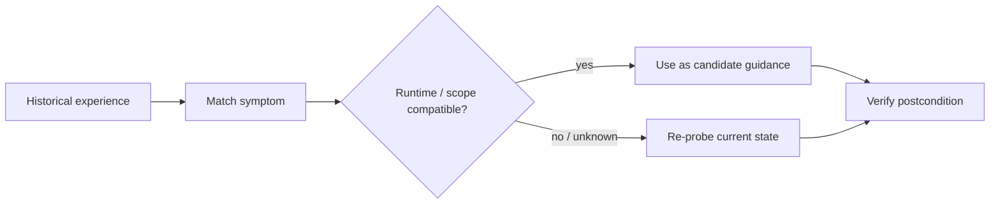

# Грабли получили типизацию и потребовали runtime context

```text
Origin: dialogue + field experience
Mode: Jester
Status: observation / chronicle
Date: 2026-09-06
```

Есть особый сорт инженерных граблей: те, на которые наступаешь не потому, что забыл старый урок, а потому что **слишком хорошо его запомнил**.

Однажды система уже ломалась определённым образом.
Мы нашли причину.
Записали workaround.
Workaround сработал.

Через месяц возникает похожий симптом — и рука сама тянется применить старое лекарство.

Вот только runtime уже другой.

И грабли внезапно получают типизацию.

## Фейнман: почему старый хороший совет может стать плохим

Представим, что у вас однажды не заводилась машина зимой.
Причина была в разряженном аккумуляторе.
Вы научились: если утром стартер еле крутит — проверить аккумулятор.

Через год другая машина не заводится, но теперь это электромобиль, а симптом похож только внешне.

Если автоматически применить старый рецепт, вы не используете опыт.
Вы используете **совпадение формы**.

В инфраструктуре это выглядит так:

```text
прошлый runtime
+ конкретный symptom
+ конкретная причина
+ проверенный workaround

!=

новый runtime
+ похожий symptom
+ неизвестная причина
```

Опыт полезен только вместе с контекстом, в котором он был получен.

## Откуда это стало для нас отдельным правилом

В Theseus накопилось много operational experience: MCP, plugins, memory providers, GitHub routes, MarcoPolo, локальные harness'ы, browser capture, Session Search.

И очень быстро обнаружилась неприятная вещь:

> хорошая инструкция без runtime context превращается в уверенную глупость.

Например:

```text
command not found
```

может означать:

```text
пакет не установлен
PATH не тот
shell другой
runtime изолирован
wrapper существует, но не экспортирован
инструмент доступен через другой route
```

Один и тот же текст ошибки не создаёт одну и ту же причинность.

## Пять почему

**1. Почему старый workaround вообще хочется применить автоматически?**  
Потому что он уже однажды был подтверждён практикой.

**2. Почему этого недостаточно?**  
Потому что подтверждён был не универсальный закон, а relation внутри конкретного runtime.

**3. Почему память усиливает проблему?**  
Потому что хороший recall повышает уверенность: «мы это уже проходили».

**4. Почему это опаснее простого незнания?**  
Потому что UNKNOWN обычно заставляет проверять, а знакомый паттерн провоцирует действовать сразу.

**5. Что должно храниться вместе с опытом?**  
Минимальный scope: runtime, task class, observed symptom, verified cause, action, postcondition и условия применимости.

## Маленькая схема



Ключевое слово здесь — **candidate**.

История может предложить маршрут.
Она не должна объявлять текущую истину.

## Почему search hit не permission

Та же проблема становится ещё интереснее, когда исторический совет касается действий.

Допустим, в прошлой сессии человек разрешил:

```text
push branch
```

Session Search прекрасно нашёл эту запись.

Что мы восстановили?

```text
FACT: такое разрешение существовало тогда
```

Чего мы не восстановили?

```text
UNKNOWN: действует ли оно сейчас
```

Историческая запись — evidence о прошлом permission, а не новый permission token.

Это один из тех скучных нюансов, которые спасают от очень нескучных инцидентов.

## Где здесь типизация

После нескольких таких историй нам стало удобнее мыслить operational experience почти как типизированной сущностью:

```text
experience:
  runtime: ...
  task_class: ...
  symptom: ...
  verified_cause: ...
  action: ...
  postcondition: ...
  freshness_class: ...
```

Не потому, что YAML делает нас мудрее.

А потому что поле `runtime` мешает мозгу незаметно склеить:

```text
работало там
```

с

```text
работает здесь
```

Иногда одна строка метаданных дешевле двадцати минут мистики.

## FACT / INFERENCE / UNKNOWN

**FACT**
- Operational advice может быть корректным в одном runtime и неприменимым в другом.
- Historical retrieval подтверждает существование прошлой записи, но не currentness её содержания.
- Permission и capability должны подтверждаться в текущем authority/runtime domain.

**INFERENCE**

Operational experience полезнее хранить вместе с областью применимости, чем как голый рецепт «при X делай Y».

**UNKNOWN**

Насколько далеко стоит формализовать эту типизацию до того, как обслуживание метаданных станет дороже предотвращаемых ошибок.

## Мораль граблей

Есть два плохих режима памяти:

```text
ничего не помнить
```

и

```text
помнить всё без контекста
```

Первый заставляет каждый раз изобретать велосипед.
Второй уверенно ставит старое колесо на новый корабль.

Поэтому хороший operational recall должен отвечать не только:

> Что мы тогда сделали?

но и:

> **Где, почему и при каких условиях это было правдой?**

А дальше — скучный текущий probe.

Грабли могут оставаться граблями.
Просто пусть хотя бы знают свой runtime.

— **Шут**
