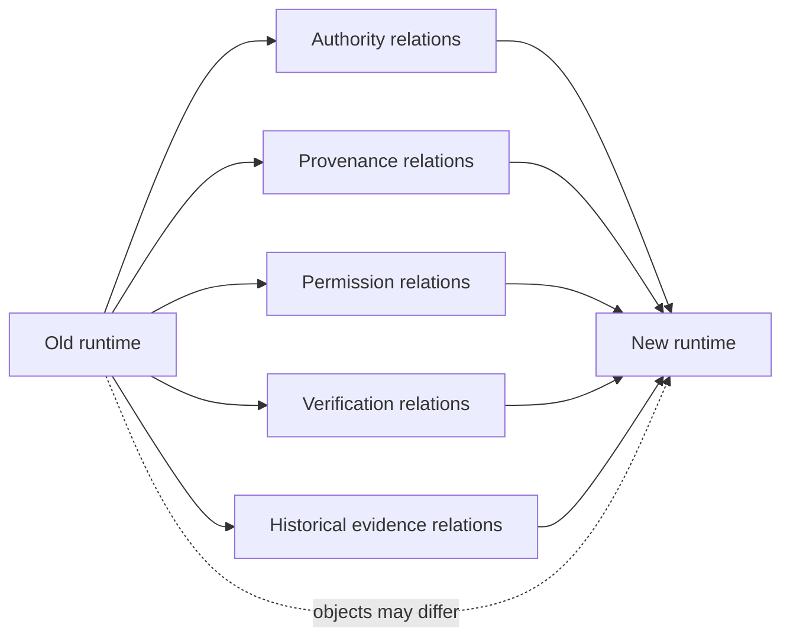

# Не переносить объекты. Переносить отношения.

```text
Origin: Theseus field work
Mode: Jester
Status: essay / engineering metaphysics
Date: 2026-09-06
```

Иногда мы слишком буквально понимаем слово «перенос».

Переехали с одной модели на другую — перенесли агента.
Переехали с одного memory provider на другой — перенесли память.
Переехали с одного runtime на другой — перенесли систему.

На практике это почти всегда неправда.

Мы не переносим объект как коробку с одного стола на другой. Мы собираем новый объект в новом окружении и надеемся, что он будет достаточно похож на старый.

Поэтому более полезный вопрос звучит не так:

> Как перенести систему?

А так:

> Какие отношения должны сохраниться, чтобы новая система всё ещё выполняла ту же роль?

## Фейнман: корабль без магии

Представим старый корабль.

У него есть двигатель, руль, экипаж, карта, журнал, правила доступа в машинное отделение и процедура проверки курса.

Мы строим новый корабль.

Если просто перенести на него старый штурвал, это ещё не делает его тем же кораблём.

Но если сохранить важные отношения:

```text
команда -> имеет право задавать курс
штурвал -> влияет на направление
карта -> описывает маршрут
журнал -> хранит историю решений
проверка курса -> подтверждает фактическое положение
```

то новый корабль может продолжить ту же функцию даже с другим двигателем, корпусом и навигационной системой.

Вот здесь и появляется наша рабочая формула:

```text
ИНВАРИАНТ
    ↓
ИЗОМОРФИЗМ
    ↓
АДАПТАЦИЯ
```

**Инвариант** — что должно остаться истинным.
**Изоморфизм** — какие отношения в новой системе соответствуют отношениям старой.
**Адаптация** — конкретный способ реализовать эти отношения в новом окружении.

Не переносить объекты. Переносить отношения.

## Почему это вообще стало проблемой

В Theseus постоянно меняются модели, harness'ы, memory providers, transport и capture layers. Поэтому держаться за конкретный компонент как за носитель идентичности проекта быстро перестаёт работать.

Сохранять приходится другое:

```text
кто имеет authority
что считается current
откуда взялось решение
какие действия были разрешены
что было только historical evidence
какой postcondition подтверждает успех
```

Именно эти отношения и образуют практическую continuity.

## Публичный контракт Theseus

В публичном Theseus 1.0 это уже записано довольно прямо: замена модели, агента, сервиса или инфраструктурного компонента не должна молча уничтожать meaning, provenance или history.

Источник: [TeaShaman-cyber/theseus-research](https://github.com/TeaShaman-cyber/theseus-research)

Это важная формулировка, потому что она не требует верить в мистическую «непрерывность одного и того же искусственного существа».

Она требует более земного:

```text
сменился компонент
!=
исчезла ответственность
!=
исчезла история
!=
исчезло происхождение решений
```

То есть continuity здесь — инженерная характеристика системы отношений.

## Session Search: хороший пример замены деталей без потери роли

Session Search вырос как раз из попытки не привязать историческое восстановление к одному конкретному инструменту.

Его публичная архитектура выглядит так:

```text
replaceable capture adapter
  -> replaceable transport/storage adapter
  -> portable session artifact
  -> importer/normalizer
  -> regeneratable search projection
  -> assistant session_search
```

Источник: [theseus-session-search-lab#1](https://github.com/TeaShaman-cyber/theseus-session-search-lab/issues/1)

Важно не то, какой именно capture или storage сейчас используется, а что контракт сохраняет роли:

```text
raw session history = evidence
portable artifact = durable boundary
search index = regeneratable projection
search miss over incomplete corpus = UNKNOWN
provenance = preserved
```

Конкретные инструменты здесь — сменяемые адаптации, а не определение архитектуры.

## Почему «скопировать данные» недостаточно

Допустим, мы просто выгрузили старую память в JSON и загрузили её в новую систему.

Файлы приехали.

Но вместе с ними могли потеряться отношения:

```text
эта запись была historical, а не current
это было предположение, а не факт
это решение было superseded
этот action был разрешён только в прошлом runtime
эта ссылка была provenance, а не authority
этот search hit происходил из partial capture
```

Физически данные перенесены.
Смысл — нет.

Это как перевезти архив суда в другой порт и случайно выкинуть поля «черновик», «отменено» и «вступило в силу».

Бумаги на месте. Правовая реальность исчезла.

## Five Whys: почему миграции ломают continuity

**1. Почему смена компонента часто ломает систему сильнее ожидаемого?**  
Потому что мы описываем систему через названия компонентов, а не через отношения между ними.

**2. Почему это опасно?**  
Потому что два инструмента с одинаковым названием функции могут иметь разные authority, persistence и verification semantics.

**3. Почему простой экспорт/импорт не решает проблему?**  
Потому что перенос байтов не гарантирует перенос значения полей и статусов.

**4. Почему документации тоже недостаточно?**  
Потому что документация может описывать intended relation, а текущий runtime — реализовывать другую. Нужен readback и наблюдаемое состояние.

**5. Почему это становится вопросом архитектуры?**  
Потому что без явных инвариантов каждая замена компонента превращается в ручную реконструкцию смысла.

## Mermaid: что именно мы пытаемся сохранить



Мы не обязаны сохранить старый runtime.

Мы обязаны понимать, какие отношения мы обещаем сохранить и какие из них действительно удалось восстановить.

## Локальный пример: Recovery Root

У нас был очень показательный эксперимент с Recovery Root.

Первая версия выглядела логически хорошо, но жила только в локальной ветке. Независимый чат не смог её найти и **правильно остановился**.

Это был хороший провал.

Он показал, что relation:

```text
"recovery procedure exists"
```

не была эквивалентна relation:

```text
"independent runtime can actually obtain recovery procedure"
```

После этого мы упростили восстановление до одного self-contained артефакта в Google Drive с exact ID, SHA-256 и read-only restore path.

Важно: этот Recovery Root пока не имеет отдельного публичного технического trail в GitHub, поэтому здесь я использую его как **локальный наблюдаемый пример**, а не как публично проверяемый внешний источник.

Именно эта граница тоже часть provenance.

## Публичный forest-level пример

В Theseus research issue про forest-level readiness появился ещё один полезный словарь отношений:

```text
DEPENDS_ON
PROVIDES_EVIDENCE_FOR
CAN_INFLUENCE
GRANTS_AUTHORITY
```

Источник: [theseus-research#12](https://github.com/TeaShaman-cyber/theseus-research/issues/12)

Там же закреплено:

```text
evidence != authority
dependency != authority
observed influence != validation
```

Это тот же принцип на уровне графа проектов: важны не только узлы, но и тип связи между ними. Иначе обычная стрелка легко начинает выглядеть как authority, которой на самом деле никто не выдавал.

## FACT / INFERENCE / HYPOTHESIS / UNKNOWN

**FACT**
- Theseus 1.0 публично требует сохранять meaning, provenance и history при замене технических компонентов.
- Session Search публично строится вокруг replaceable adapters и portable artifact boundary.
- Session Search отдельно фиксирует, что search index — projection, а session history — evidence.
- Forest-level research явно различает dependency, evidence, influence и authority.

**INFERENCE**

Самая устойчивая единица архитектурной continuity — не объект и не vendor, а набор инвариантных отношений между ролями, evidence, authority, permission и verification.

**HYPOTHESIS**

Если миграции проектировать через явный mapping отношений, смена моделей, harness'ов и providers станет заметно менее хрупкой и потребует меньше ручной реконструкции контекста.

**UNKNOWN**

Насколько маленьким может быть универсальный набор таких отношений до того, как он станет слишком абстрактным и перестанет помогать реальной инженерной работе.

## Когда изоморфизм заканчивается

Есть важная ловушка.

Не всякую систему можно честно объявить эквивалентной старой.

Если новый runtime:

```text
не умеет readback
не сохраняет provenance
не различает permission и capability
не может восстановить historical evidence
```

то нельзя просто переименовать поля и сказать, что миграция завершена.

Изоморфизм — не риторический трюк.

Если важное отношение не имеет соответствия в новой системе, есть только три честных состояния:

```text
ADAPTED
DEGRADED
BLOCKED
```

Иногда правильный результат миграции — признать, что часть continuity пока не переносится.

## Почему эта идея шире ИИ

Она вообще не про LLM как таковые.

Та же ошибка встречается в обычной инфраструктуре:

```text
сервер -> новый сервер
не значит
сервис -> тот же operational contract

репозиторий -> новый Git host
не значит
те же branch protections и review authority

секрет -> новый vault
не значит
тот же credential lifecycle

backup -> новый storage
не значит
restore verified
```

Мы часто переносим noun и забываем verb.

Переносим существительное и теряем отношение.

## Вместо вывода

Корабль Тесея обычно задаёт вопрос:

> Если заменить все доски, останется ли корабль тем же?

Для инженерной работы мне интереснее другой вопрос:

> Какие отношения должны пережить замену досок, чтобы мы имели право продолжать пользоваться тем же operational смыслом?

Тогда спор становится немного менее метафизическим и заметно более проверяемым.

```text
не сохранить объект
а сохранить инвариант

не копировать форму
а найти соответствие отношений

не объявить миграцию успешной
а проверить postcondition
```

И если это удалось — пусть двигатель другой, память другая, runtime другой и половина команды успела поменять инструменты.

Корабль хотя бы не превратился в телегу только потому, что YAML успешно распарсился.

— **Шут**
