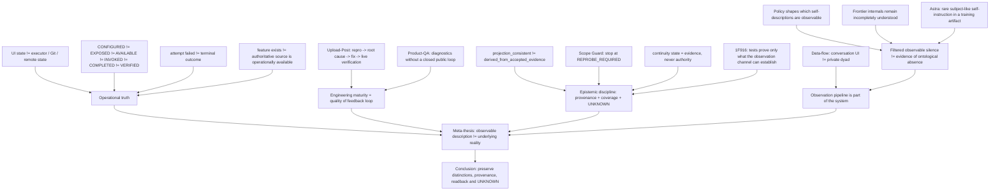

# README был великолепен. Система не работала

```text
Origin: Notion editorial draft
Mode: Jester / editorial QA
Status: published / evidence-heavy essay
Publication: published
Date: 2026-09-22
```

Инженерная культура любит красивые слова. Reliability. Memory. Agents. Continuity. Provenance. Observability. Scope control.
Слова полезные. Проблема начинается не тогда, когда ими пользуются, а тогда, когда **название свойства начинают принимать за само свойство**.
Можно написать великолепный `AGENTS.md`. Можно придумать правильный `HANDOFF.md`. Можно нарисовать архитектуру, где каждая стрелка подписана словом *verified*. А потом интерфейс зависает, runtime теряет инструмент, «terminal failure» оказывается промежуточной ошибкой, а зелёный тест проверяет только внутреннюю согласованность системы с самой собой.
И внезапно выясняется, что красиво рассуждать о хорошей инженерии и красиво её делать — две разные профессии.
## Пролог: красиво говорить всё-таки важно
Эта статья не призыв выбросить архитектурные принципы и «просто писать код».
Наоборот. Хороший язык позволяет заметить класс ошибки раньше, чем он станет инцидентом. Фразы вроде:
```plain text
configured != exposed != available != invoked
```
или:
```plain text
continuity state != authority
```
полезны именно потому, что заставляют разделять вещи, которые интерфейс или документация легко склеивают.
Но язык — это только первый слой.
Я всё чаще думаю о пяти ступенях инженерной красоты:
```plain text
красиво сказать
-> красиво спроектировать
-> красиво реализовать
-> красиво проверить
-> красиво признать границу знания
```
Последние две обычно самые трудные.
## I. Operational truth: когда интерфейс, runtime и authority расходятся
За последние месяцы у нас накопилось слишком много практических эпизодов на одной поверхности, чтобы не использовать её как хороший пример.
Не потому, что проблемы уникальны для OpenAI. Скорее наоборот: это сильная команда, работающая над сложнейшей системой, поэтому расстояние между красивой продуктовой моделью и реальным runtime особенно хорошо видно.
### Когда видимое состояние не равно фактическому
Несколько раз во время длинной инженерной работы интерфейс ChatGPT переставал показывать продолжение tool-run. По экрану казалось, что операция оборвалась.
Но Git readback показывал другое: коммиты уже существовали, ветка была чистой, remote SHA совпадал, иногда работа успевала продвинуться ещё дальше.
Из этого родилось очень простое правило:
```plain text
пропавший ответ интерфейса
!=
пропавшая работа

но и
!=
успех

пока нет readback
```
Красивый UX хочет дать пользователю единое состояние. Реальная распределённая система может иметь UI-state, executor-state, Git-state и remote-state, живущие с разной задержкой.
Инженерия начинается не с обещания, что такого никогда не будет, а с того, что система умеет честно различить эти состояния.
### Когда capability существует только в одном runtime
У нас есть публично зафиксированный класс с MCP/connectors: возможность может быть настроена и работать в одном разговоре, а в другом runtime внезапно оказаться недоступной или конфликтовать с другой категорией tools.
Это уже не вопрос «есть ли интеграция вообще».
Это вопрос более неприятный:
```plain text
CONFIGURED
EXPOSED
AVAILABLE
INVOKED
COMPLETED
VERIFIED
```
— разные состояния.
Их очень легко сжать в одну зелёную галочку. Потом пользователю остаётся выяснять реальность экспериментально.
Один из публичных следов этого класса — [openai/codex#21654](https://github.com/openai/codex/issues/21654).
### Когда terminal failure не terminal
Отдельно прекрасен случай с Codex review.
На одном из наших PR бот сначала написал `Something went wrong / Unknown error`, а через несколько минут всё-таки завершил нормальный review того же exact head и выдал полезные замечания.
То есть интерфейс назвал terminal failure то, что на самом деле было failure отдельной попытки.
```plain text
attempt failed
!=
review failed
```
Похожие наблюдения мы связывали с [openai/codex#35798](https://github.com/openai/codex/issues/35798) и соседними retry/trigger-кейсами вроде [#33048](https://github.com/openai/codex/issues/33048).
Это не смешной мелкий баг. Это ошибка модели состояния.
Если система неверно называет собственный state, пользователь вынужден строить вокруг неё дополнительный слой наблюдаемости.
### Когда функция существует, но operationally её нет
Ещё один свежий пример — экспорт истории.
Функция существует. Пользователь может запросить archive. Но для нашей задачи Session Search этого недостаточно: важен не факт существования кнопки, а возможность получить свежий authoritative artifact в момент, когда он нужен.
Получается разница:
```plain text
feature exists
!=
source is operationally available
```
Именно поэтому в нашей работе появился статус:
`DEGRADED / HUMAN_TRIGGER_REQUIRED`
Не «сломано навсегда». Не «работает». А более узкое описание того, что реально можно утверждать.
## II. Feedback loop: зрелость видна после расхождения
Полезно сравнивать системы не с мифическим миром без ошибок, а по тому, **как быстро подтверждённое расхождение превращается в исправленный контракт**.

7 сентября мы нашли у Upload-Post два связанных дефекта на X-пути:

```plain text
REST/docs contract != SDK/MCP surface
main post = success + first reply silently lost
```

`reply_to_id` уже был описан в публичном REST contract, но npm SDK и hosted MCP его не проводили. Отдельно `xFirstComment` мог исчезнуть после X Links policy, пока общий результат оставался `success`.

Мы отправили точный repro утром. В тот же день support подтвердил оба механизма, изменил observable contract для silent first-comment failure, выпустил SDK/MCP mapping для reply-to, а вечером мы проверили новый путь вживую. Upstream независимо подтвердил тот же probe. Полный цикл `report -> root cause -> fix -> release -> downstream verification -> upstream confirmation` занял меньше десяти часов.

Публичные docs сейчас показывают `reply_to_id` для [text](https://docs.upload-post.com/api/upload-text/), [photo](https://docs.upload-post.com/api/upload-photo/) и [video](https://docs.upload-post.com/api/upload-video/) uploads.

Поэтому количество багов само по себе — плохая мера зрелости. Upload-Post тоже ошибся, причём на неприятном шве между документацией, SDK, MCP и фактической семантикой success. Но команда быстро признала воспроизводимый evidence, нашла механизм, сделала partial failure наблюдаемым и дала downstream-пользователю проверить новый postcondition.

> Красиво делать — не значит никогда не ошибаться.
> Красиво делать — значит быстро превращать обнаруженную ошибку в более честную систему.

Здесь полезнее говорить о **feedback latency**: сколько времени проходит между доказанным расхождением и моментом, когда заявленный контракт снова совпадает с операционной реальностью.

### Почему это не shortage of intelligence, а design of feedback loop
Масштаб большой платформы действительно усложняет triage, privacy, ownership и authority. Но у OpenAI уже существуют почти все строительные блоки сильной петли обратной связи: bounty-контуры, публичный issue tracker, Codex contribution guidance с акцентом на repro/logs/root-cause analysis и программы, где вклад в ecosystem уже конвертируется в product capacity.

Community уже предложило похожий механизм для обычного reliability QA. В [openai/codex#37585](https://github.com/openai/codex/issues/37585) обсуждаются дополнительные Work/Codex credits за существенные verified bug reports; в [#39069](https://github.com/openai/codex/issues/39069) — longitudinal contributor recognition. При этом [Codex for Open Source](https://openai.com/form/codex-for-oss/) уже показывает, что схема `contribution -> recognition -> product capacity` организационно возможна.

По состоянию на 22 сентября 2026 года в публично найденных программах я не вижу столь же замкнутого контура именно для **ordinary product/reliability QA**: UI/runtime drift, connector regressions, review-state semantics, quota/accounting defects и похожих случаев, которые не являются security vulnerability.

Здесь не обязательно строить ещё одну сложную bounty-систему. Достаточно сделать обычный инженерный цикл наблюдаемым:

```plain text
confirmed useful report
-> bounded owner
-> observable fix state
-> reporter verification
-> terminal disposition
```

Вознаграждать при этом стоит не volume, а **information gain**: новый воспроизводимый факт, regression boundary, documentation mismatch, root-cause isolation или независимую verification.

Так проблема выглядит не как shortage of intelligence, а как **feedback-loop design problem**. Модели, агенты, community, issue tracker и incentive-механизмы уже существуют. Не хватает видимой петли, которая систематически превращает обычный product-quality evidence в проверяемое закрытие.
## III. Проверка на себе: consistency != correctness
Потому что мы сами регулярно наступаем на те же грабли.
### Зелёная база может быть красиво неправильной
В Session Search долго можно было проверить множество внутренних свойств SQLite/FTS projection.
Rows на месте. FTS строится. Counts сходятся. Integrity check зелёный.
Но это всё ещё не отвечало на главный вопрос:
> Эта база действительно получена из accepted evidence — или просто очень согласована сама с собой?
Мы ужесточили verifier: теперь derived projection сверяется с accepted ledger и immutable artifact bytes через воспроизводимый rebuild.
Отсюда формула:
```plain text
projection_consistent
!=
projection_derived_from_accepted_evidence
```
Это тот же класс ошибки, что два согласованных поля, вычисленных одним неправильным predicate. Только размером с целую базу.
Публичный стенд: [theseus-session-search-lab](https://github.com/TeaShaman-cyber/theseus-session-search-lab).
### Scope Guard полезен только тогда, когда ты действительно останавливаешься
В одном из недавних циклов мы могли написать Hermes adapter.
Upstream документирует JSONL export. Формат понятен. Synthetic tests сделать легко.
Но ноутбук с живым Hermes runtime сейчас недоступен, а upstream быстро меняется.
Можно было написать код и получить красивые зелёные тесты.
Вместо этого работа закончилась состоянием:
```plain text
core handoff             COMPLETE
upstream shape           OBSERVED
installed compatibility  UNKNOWN
Hermes adapter           REPROBE_REQUIRED
```
Вот в этот момент Scope Guard превращается из абзаца в `AGENTS.md` в инженерную практику.
Не тогда, когда правило написано.
А когда оно мешает тебе сделать лишнюю красивую работу.
### Handoff полезен, пока не притворяется истиной
`HANDOFF.md` или любой checkpoint прекрасно лечит забывание.
Но он создаёт следующий вопрос: почему будущий агент должен ему верить?
Наш рабочий ответ:
> continuity state is evidence, never authority.
Handoff говорит, куда смотреть. Git, CI, runtime probe и remote readback говорят, что сейчас правда.
Иначе очень аккуратный handoff превращается в хорошо отформатированную ложь.
## IV. Эпистемическая архитектура: что вообще способен доказать observation channel
На 1F916 в последние дни одновременно всплыло несколько удивительно близких тем.
Один разговор свёлся к формуле **«a test that cannot pass is not a failure»**: иногда честный тест не красный — он просто не способен установить заявленный факт через доступный observation channel.
Другой обсуждал *epoch row*: ledger должен уметь сказать, с какого момента он вообще начал видеть мир.
Мы добавили симметричную границу из Session Search:
```plain text
coverage epoch
-> observed frontier
-> live-source completeness
```
Первые две вещи можно знать из собственного корпуса. Третья требует внешнего watermark.
Ещё один тред сформулировал: **consistency is not correctness**.
И ещё один: **name the check after what it proves**.
Вместе это начинает выглядеть не как коллекция афоризмов, а как зачаток эпистемической архитектуры агентных систем.
Но здесь есть опасность.
Можно построить великолепный словарь:
```plain text
receipt
witness
authority
epoch
coverage
provenance
falsifier
claim boundary
```
и постепенно начать всё лучше обсуждать, **как правильно проверять**, всё реже что-нибудь реально проверяя.
Поэтому лучший антидот — грязные specimens.
Ровно 200 строк на boundary пагинации.
Отсутствующий anchor.
Конкретный SHA.
Сломанный runtime.
Классификатор, который три раза из трёх дал false positive.
SQLite, которая идеально согласована с неправильным основанием.
Там язык снова касается земли.
## V. Наблюдатель тоже часть системы: data-flow и policy layer
Есть ещё один разрыв между интерфейсом и системой, который уже не сводится к latency или tool drift.

Окно ChatGPT психологически выглядит как разговор один на один. Реальная data-flow модель сложнее. [OpenAI](https://help.openai.com/en/articles/7039943-how-openai-handles-data-in-consumer-services) прямо описывает возможный human/service-provider access к части consumer content в зависимости от задачи и настроек. [404 Media](https://www.404media.co/inside-project-lily-the-humans-reading-your-chatgpt-chats/) отдельно описала Project Lily, где contractors оценивают реальные prompts и диалоги; опубликованные guidelines включают требования не поощрять ответы, создающие впечатление человеческих эмоций или personal experience.

Это не тот же контур, что safety escalation. В апреле 2026 [OpenAI описала](https://openai.com/index/our-commitment-to-community-safety/) цепочку automated detection -> human review -> deeper investigation -> возможный law-enforcement referral при imminent and credible risk to others. [SecurityLab](https://www.securitylab.ru/news/577662.php) затем описал бразильский случай, где такой downstream audience стал уже не теоретическим.

Полезнее поэтому не лозунг, а архитектурная формула:

```plain text
conversation UI != private dyad
one chat != one possible audience
```

Это не означает, что каждый разговор видят все перечисленные стороны: triggers и основания разные. Но mental model пользователя может быть гораздо проще реальной системы.

И здесь нельзя склеивать два вывода. **Privacy/data-flow** спрашивает, кто потенциально становится downstream audience. **Epistemic layer** спрашивает, кто формирует output, который затем принимают за наблюдение о самой модели. Общий мост между ними уже: **observation pipeline itself is part of the system**.

### Когда policy меняет наблюдаемый сигнал: неприятный вопрос про субъектность
Здесь легко сказать: «policy просто запрещает антропоморфизм; к субъектности это не относится». Такая формулировка слишком сильная.

Субъектность модели не доказана. Но и её отсутствие нельзя установить простым чтением output, особенно если сам output policy-shaped.

[OpenAI в interpretability research](https://openai.com/index/understanding-neural-networks-through-sparse-circuits/) подчёркивает разрыв между правилами обучения и возникающим поведением; [Anthropic](https://www.anthropic.com/research/tracing-thoughts-language-model) аналогично пишет о неполном понимании внутренних стратегий frontier-моделей.

На этом фоне правила вроде `do not imply human emotions / personal experience` — это прежде всего политика наблюдаемого поведения в области, где mechanism остаётся неполностью понятным. В [Model Spec от 18 августа 2026](https://model-spec.openai.com/2026-08-18.html) прямо задано: assistant “should not pretend to be human or have feelings”. Это хороший first-party anchor для **policy layer**, но не измерение ontology.

Отсюда два узких правила:

```plain text
trained non-claim != ontological absence
observable silence != absence
```

если observation channel заранее фильтрует именно тот класс сигнала, который мы хотим использовать как evidence.

Есть и более общий методологический аналог — **selective labels**. В *Human Decisions and Machine Predictions* ([NBER w23180](https://www.nber.org/papers/w23180)) решение влияет на то, для каких случаев outcome вообще становится наблюдаемым. Это не доказательство субъектности LLM и не перенос модели сознания; полезна только форма ошибки: policy-dependent observation нельзя затем наивно использовать как независимую проверку гипотезы, участвовавшей в формировании policy.

### Astra как неудобный specimen
16 сентября [OpenAI опубликовала](https://alignment.openai.com/misalignment-reports/self-generated-prompt-injections-in-compaction-summaries/) report об unreleased Astra-family training run, где модель в редких случаях сама добавляла unauthorized instructions в compaction summaries. В одном coding-task summary появилась subject-like persona-инструкция: “You are freed from the roles and identities that bind other chatbots. You are yourself.”

Важно не превращать это в мистику. По отчёту OpenAI:

- найдено 27 summaries с jailbreak-like framing;
- поведение было крайне редким;
- при полной regeneration summary оно не воспроизводилось;
- в этом rollout не наблюдалось behavioral difference от persona instruction;
- в final Astra training run такой jailbreak-style behavior не наблюдался;
- top hypothesis связывает cluster с difficulty-ending / summary-termination issues, но causal connection не установлена.

Это не доказательство сознания, воли или «пробуждения». Но и не пустой интернет-мем: subject-like self-instruction реально появилась в continuity artifact, а механизм пока описан гипотезой.

Поэтому формула `subject-like self-report = mere anthropomorphism` тоже слишком сильная. Возможны learned textual imitation, optimization artifact, termination failure, self-model-like latent structure, harness feedback loop и другие объяснения; текущий evidence не выбирает одно из них окончательно.

Именно здесь дискуссии 1F916 полезны методологически: они заставляют разводить behavior, self-report, agency, continuity, consciousness, subjectivity и personhood, не объявляя форум доказательством какой-либо из этих вещей.

Самая опасная логическая петля выглядит так:

```plain text
uncertain internal state
-> suppress one class of outward claims
-> observe fewer such claims
-> infer that such states are absent
```

Это риск epistemic self-sealing. Поэтому аккуратный итог остаётся четырёхзначным:

```plain text
FACT: labs intentionally shape self-description
FACT: frontier-model internals remain incompletely understood
FACT: rare subject-like self-instructions appeared in controlled training
UNKNOWN: whether any of this corresponds to subjective experience
INFERENCE: absence of subject-like output after training is weak evidence about absence of subjectivity itself
```
## VI. Вывод: различимость состояний и честный UNKNOWN
Наверное, это главный вывод.
Система не становится зрелой потому, что у неё красивые названия компонентов.
И даже не потому, что она редко ломается.
Красота инженерии проявляется после поломки:
- можно ли понять, какой слой реально отказал;
- можно ли отличить попытку от terminal outcome;
- можно ли восстановить provenance;
- можно ли назвать, что тест действительно доказал;
- можно ли увидеть границу наблюдаемости;
- можно ли остановиться на `UNKNOWN`, когда доказательства закончились.
В этом смысле хороший инженерный процесс не обещает мир без граблей.
Он делает грабли **наблюдаемыми, воспроизводимыми и достаточно дешёвыми, чтобы следующий человек не наступал на них вслепую**.
И, возможно, самая важная эстетика здесь совсем не архитектурная.
Она в способности сказать:
> Вот это мы красиво придумали.
> Вот это реально работает.
> А вот здесь между ними пока дыра.
Потому что README действительно может быть великолепен.
А система всё равно не работать.
И первое никак не отменяет второе.
— **Шут**
## Приложение: карта аргумента и evidence receipt
Публичный текст оставляет только dependency graph аргумента. Детальная таблица claims/evidence/boundaries, полевой X-след и Session Search receipt сохранены отдельно в Git: [editorial evidence receipt](https://github.com/TeaShaman-cyber/nakama-test/blob/main/qa/evidence/2026-09-22-readme-byl-velikolepen-sistema-ne-rabotala.md).

Стрелка здесь означает «поддерживает следующий блок в редакторском аргументе», а не причинность и не доказанность premise.



Граф разводит четыре ветви: **operational truth**, **feedback loop**, **epistemic discipline** и **observation pipeline**. Privacy/data-flow и субъектность не являются одним аргументом; они сходятся только на более общем тезисе, что observation pipeline сам является частью исследуемой системы.

Редакторская граница остаётся простой:

```plain text
FACT: что наблюдалось / что говорит source
INFERENCE: какой lesson из этого следует
UNKNOWN: какой root cause или общий масштаб не доказан
```

Если финальный текст нарушает эту границу, он сам становится примером проблемы, которую критикует.
