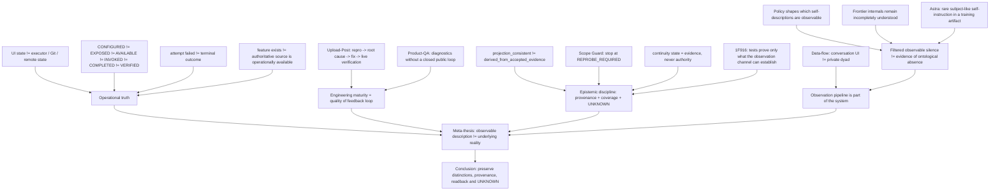

# Editorial evidence receipt — README был великолепен. Система не работала

```text
Article: journal/2026-09-22-readme-byl-velikolepen-sistema-ne-rabotala.md
Captured-From: pre-compression draft
Purpose: preserve detailed editorial provenance outside the reader-facing article
Authority: evidence/supporting receipt, not publication authority
```

## Приложение: редакторский evidence pack
Этот раздел — не часть финального ритма статьи, а проверочный пакет перед публикацией: какой тезис на что опирается и где заканчивается доказательство.
### Карта аргумента
Эта схема — редакторский dependency graph, а не доказательство сама по себе. Стрелка означает «этот блок поддерживает следующий», а не причинность.

Граф специально разводит четыре ветви: **operational truth**, **feedback loop**, **epistemic discipline** и **observation pipeline**. Самая важная граница — последняя: privacy/data-flow и субъектность не являются одним аргументом; они сходятся только на более общем тезисе, что observation pipeline сам является частью исследуемой системы.

| Claim | Observable evidence | Boundary |
| --- | --- | --- |
| Configured / authorized capability может исчезнуть в том же рабочем периоде | [openai/codex#42687](https://github.com/openai/codex/issues/42687): GitHub identity и `admin` permission были видимы, затем native connector/tool path становился unavailable; независимый GitHub CLI route продолжал видеть repository state. | Доказывает longitudinal capability drift в конкретных сессиях; не устанавливает root cause и не доказывает account-wide failure. |
| Видимый error может не быть terminal outcome | [openai/codex#35798](https://github.com/openai/codex/issues/35798): review публиковался успешно одновременно с ошибками «model is not available». Наш свежий repro 2026-09-19: `Unknown error` в 02:39:50 UTC, затем нормальный review того же exact head в 02:43:55. | Поддерживает `internal attempt failure != terminal review failure`; не утверждает общий механизм fallback/retry. |
| Connector может спорить с authority source о существовании state | [openai/codex#44236](https://github.com/openai/codex/issues/44236): connector отвергал валидный PR-head SHA как missing ref, хотя GitHub REST, branch ref, pull ref и commit endpoint разрешали тот же SHA. | Доказывает ref-resolution mismatch; не переносится автоматически на все Codex review failures. |
| Runtime discovery не равна live tool availability | [openai/codex#31374](https://github.com/openai/codex/issues/31374): runtime logs перечисляли MCP tools, но live Desktop thread не всегда имел их как callable surface; `thread_dynamic_tools` при этом мог быть пуст. | Сильный независимый аналог нашего `CONFIGURED -> EXPOSED -> AVAILABLE` split; это report конкретного пользователя, не универсальная характеристика продукта. |
| Data export как feature не означает мгновенный operational source | [официальная инструкция OpenAI](https://help.openai.com/en/articles/7260999-exporting-your-chatgpt-history-and-data): export доставляется email/SMS и «can take up to 7 days to arrive»; self-service также зависит от workspace type. | Это официальный contract, а не баг. Для Session Search он означает лишь, что export не является low-latency authoritative acquisition channel. |
| Optional host capabilities следует feature-detect и уметь переживать их отсутствие | [OpenAI MCP Apps compatibility](https://developers.openai.com/apps-sdk/mcp-apps-in-chatgpt): для ChatGPT-specific extensions прямо рекомендуются feature detection и graceful degradation. | Не признаёт наши конкретные runtime bugs; зато подтверждает саму архитектурную необходимость не считать host extension безусловной capability. |

### Полевой публичный след
5 сентября 2026 в X уже была опубликована почти готовая версия тезиса статьи — после серии собственных reproducible cases:
- [начало треда](https://x.com/i/status/2096190006234697992): «a sincere compliment wrapped in an engineering complaint»;
- [снимок issue-search того дня](https://x.com/i/status/2096190015432806560): counts были зафиксированы как **snapshot 2026-09-05**, не как вечная статистика;
- [state transition](https://x.com/i/status/2096190013927010613): `authority visible -> operation -> GitHub tool namespace disappears`;
- [robotic cobbler](https://x.com/i/status/2096190024203051123): «You built a magnificent robotic cobbler. Please give the cobbler some fucking shoes.»;
- [configured != available != verified](https://x.com/i/status/2096649075730866344), 6 сентября;
- [custom MCP / discoverability field note](https://x.com/i/status/2096911018840441039), 7 сентября;
- [session search vs mystery summaries](https://x.com/i/status/2097070161136160783), 7 сентября;
- [две заявки на export, архивов 0](https://x.com/i/status/2097286972490264815), 8 сентября;
- [контрольный контраст с DeepSeek/Grok](https://x.com/i/status/2097300336813752695), 8 сентября.
Эти посты полезны как **датированный first-person field log**, а не как независимая статистика качества OpenAI.
### Что дал ретривал — и исправление по Session Search
Default retrieval поднял дополнительные ранее зафиксированные классы: Codex threads/state, существующие локально, но исчезающие из UI/index; review/tool boundaries, которые менялись между surfaces; quota/runtime availability как отдельный слой от code correctness.
Первый редакционный проход ошибочно пометил активный Session Search corpus как `UNAVAILABLE`. Повторная проверка показала, что проблема была **не в corpus, а в route discovery**: поиск шёл рядом с repository, хотя Session Search по дизайну не имеет hidden/default corpus path и требует явный `--corpus`.
Исторический canonical private root всё это время оставался в MarcoPolo:
```plain text
/workspace/research/barn-session-search/current-corpus
-> corpus-v1-acceptance-20260901
```
Fresh verification на 22 сентября:
```plain text
status           VERIFIED
artifacts        61
sessions         56
messages         76,060
FTS rows         72,700
message_sources  81,351
payload_pages    138
SQLite integrity ok
```
Corpus включает Barn Doctor, Barn recovery, DeepSeek export, Speed Booster export и dialogue bridge.
Его observed frontier сейчас заканчивается 11 сентября, поэтому он является **verified historical evidence**, но не доказательством текущего состояния продукта на 22 сентября.
И да — история действительно содержит большой пласт user-authored field complaints о сломанном/лагающем ChatGPT. Простые lexical counts внутри user messages дают:
```plain text
chat + interface    115
chat + loading       45
chat + hang         340
browser             127
context + loss      180
export + chat        18
```
Это **число сообщений, совпавших с поисковыми признаками**, а не число уникальных багов или root causes.
Несколько provenance-bound примеров:
- 29 августа: жалоба, что проблема загрузки чатов существует давно, новые features/front-end меняются, а проблема сохраняется и в desktop/Codex surfaces;
- 3 сентября: Barn capture описан как чат, который «задохнулся в багах OpenAI на длинных чатах»;
- 5 сентября: «ещё одна ветвь чата умерла» и была передана в Barn Doctor для восстановления через Session Search;
- 5 сентября: формулировка про «прекрасные нейросети», которые умеют архитектуру/debugging/frontend, при этом chat-loading bugs тянутся годами;
- 8 сентября: одновременно зафиксированы постоянные лаги chat UI, length limit, недоставленный export и повторная потеря context;
- 11 сентября: предыдущий чат снова упёрся в длину, после чего continuity пришлось переносить в новую ветку.
Один из наиболее компактных field-log фрагментов 8 сентября:
> «интерфейс сука твоих чатов постоянно лагает ... выгрузку ... чатов OpenAI не прислал, контекст теряется и приходится заново восстанавливать всё ... Больше портов чем дела»
В корпусе этот message имеет собственный `canonical_message_sha256`, session identity и source provenance. Поэтому здесь он используется не как воспоминание автора статьи, а как датированный historical artifact.
И отдельно показательно, что **ошибка самого редакционного поиска** воспроизвела тезис статьи:
```plain text
corpus not discovered
!=
corpus unavailable
```
Пока не был найден authoritative path и выполнен fresh `verify`, корректным состоянием было `UNKNOWN`, а не `UNAVAILABLE`.
### Редакторская граница
OpenAI здесь остаётся **case study**, не моральным персонажем статьи. Для каждого внешнего эпизода держать три уровня отдельно:
```plain text
FACT: что наблюдалось / что говорит source
INFERENCE: какой engineering lesson из этого следует
UNKNOWN: какой root cause или общий масштаб не доказан
```
Если финальный текст нарушает эту границу, он сам становится примером проблемы, которую критикует.
